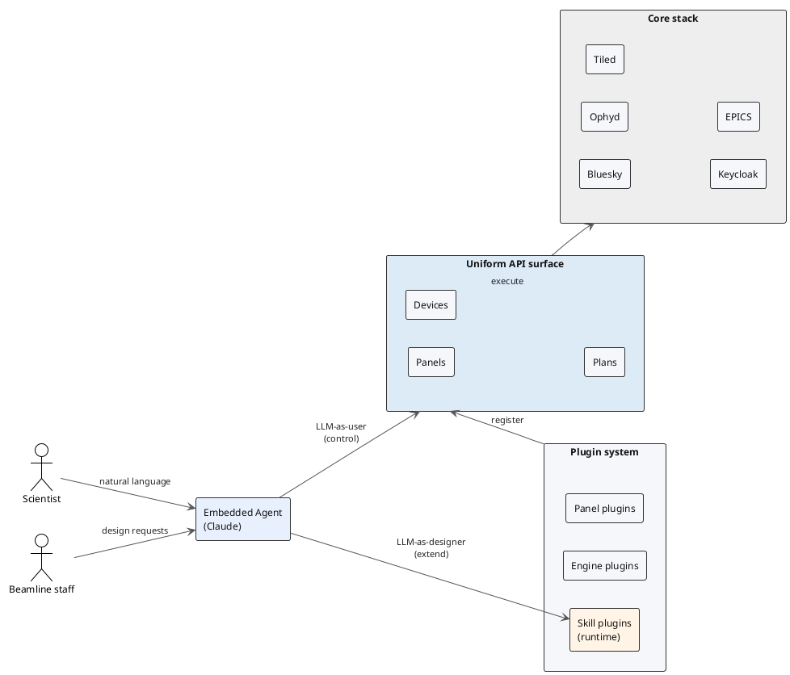

# LUCID Paper — Implementation Plan (arXiv M1)

> **For agentic workers:** REQUIRED SUB-SKILL: Use superpowers:subagent-driven-development (recommended) or superpowers:executing-plans to implement this plan task-by-task. Steps use checkbox (`- [ ]`) syntax for tracking.

**Goal:** Scaffold a new LaTeX paper repository `ncs/lucid-paper` on `git.als.lbl.gov` and populate it with an arXiv-grade first draft of the LUCID publication, meeting Milestone M1 in the design spec (`docs/superpowers/specs/2026-04-20-lucid-paper-design.md`).

**Architecture:** Self-contained paper repo. Prose lives as section partials under `content/`. Top-level `main-arxiv.tex` (with `main-jsr.tex` as a later stub) includes the partials. `biblatex`+`biber` for references; PlantUML for the architecture figure; placeholder PNGs for the three operational figures. Makefile drives `pdf`, `figures`, and `arxiv-tarball` targets. GitLab CI compiles the PDF and attaches it as an artifact on every push.

**Tech Stack:** LaTeX (`article` class), `biblatex`+`biber`, PlantUML, `latexmk`, GNU Make, Python+Pillow (placeholder figures), GitLab CI (Docker image with `texlive`+`plantuml`).

---

## Prerequisites

Before starting:

- `GITLAB_TOKEN` is present in the environment. (Already configured per `~/.claude/settings.json`.)
- SOCKS proxy at `localhost:1080` is running (required for all `*.lbl.gov` access).
- The spec has been read: `~/PycharmProjects/ncs/ncs/docs/superpowers/specs/2026-04-20-lucid-paper-design.md`.
- The LUCID pitch deck has been read: `~/workspace/lucid-pitch/index.html` (thesis framing) and `~/workspace/lucid-pitch/rebuttal.md` (sustainability narrative).
- Working tree for this work: `~/workspace/lucid-paper/` (to be created by Task 2).

---

## Task 1: Create the empty GitLab project

**Files:** none locally — this task creates the remote.

- [ ] **Step 1: Create the project via GitLab web UI**

Reason we use the web UI instead of the API: the configured `GITLAB_TOKEN` is read-only (per `memory/reference_gitlab_ci.md`), so `POST /api/v4/projects` will 403. Ask Ron to:

1. Open https://git.als.lbl.gov/projects/new (SOCKS proxy active in his browser).
2. Create a blank project in the `ncs` group named `lucid-paper`.
3. Visibility: **Internal** (matches `ncs` and `lucid-pitch`).
4. Do **not** initialize with a README — we want a clean first commit.

If Ron wants this unblocked without waiting on him, prompt him via chat and pause.

- [ ] **Step 2: Verify the project exists and get the project ID**

```bash
curl -s --socks5-hostname localhost:1080 \
  -H "PRIVATE-TOKEN: $GITLAB_TOKEN" \
  "https://git.als.lbl.gov/api/v4/projects/ncs%2Flucid-paper" \
  | python -c "import sys,json; p=json.load(sys.stdin); print(p['id'], p['ssh_url_to_repo'])"
```

Expected: prints a numeric project ID and an SSH URL like `git@git.als.lbl.gov:ncs/lucid-paper.git`. Record both for later tasks.

---

## Task 2: Clone locally and initialize

**Files:**
- Create: `~/workspace/lucid-paper/.gitignore`
- Create: `~/workspace/lucid-paper/README.md`
- Create: `~/workspace/lucid-paper/LICENSE`

- [ ] **Step 1: Clone the empty repo**

```bash
cd ~/workspace
git -c http.proxy=socks5://localhost:1080 clone https://git.als.lbl.gov/ncs/lucid-paper.git
cd lucid-paper
```

If the project was created empty, git will warn "appears to be an empty repository." That's fine.

- [ ] **Step 2: Configure the remote to use the proxy persistently**

```bash
cd ~/workspace/lucid-paper
git config --local http.proxy socks5://localhost:1080
```

- [ ] **Step 3: Create `.gitignore`**

Write `~/workspace/lucid-paper/.gitignore`:

```gitignore
# LaTeX build artifacts
*.aux
*.bbl
*.bcf
*.blg
*.fdb_latexmk
*.fls
*.log
*.out
*.run.xml
*.synctex.gz
*.toc
*.lof
*.lot
*.nav
*.snm
*.vrb

# Build outputs we do NOT commit
main-arxiv.pdf
main-jsr.pdf
arxiv-submission.tar.gz

# Editor / OS
.DS_Store
Thumbs.db
.vscode/
.idea/

# Python (for tools/)
__pycache__/
*.pyc
.venv/
```

Note: `figures/arch.pdf` is NOT gitignored — we commit the generated architecture figure per the spec.

- [ ] **Step 4: Create a minimal README**

Write `~/workspace/lucid-paper/README.md`:

```markdown
# LUCID — Publication

LaTeX source for the LUCID paper. arXiv draft first; Journal of Synchrotron Radiation later.

**Thesis:** LUCID demonstrates that a single API-first design can make a beamline control system addressable by an LLM in two complementary roles — as a user of the interface and as a developer of it.

See `docs/superpowers/specs/2026-04-20-lucid-paper-design.md` in the `ncs` repo for the design spec.

## Build

```bash
make pdf           # compile arXiv version → main-arxiv.pdf
make figures       # regenerate figures/arch.pdf from arch.puml
make arxiv-tarball # build the arXiv submission tarball
make clean         # remove build artifacts
```

## Requirements

- TeX Live (full profile, or at least `texlive-latex-extra` + `texlive-bibtex-extra` + `biber`)
- `latexmk`
- `plantuml` (only needed to regenerate `figures/arch.pdf`)
- Python 3 with Pillow (only needed to regenerate placeholder figures; see `tools/gen-placeholders.py`)

## Layout

See `docs/superpowers/specs/2026-04-20-lucid-paper-design.md` §6 for the definitive layout rationale.
```

- [ ] **Step 5: Create a BSD-3-Clause LICENSE**

LUCID itself is BSD-3-Clause. Match that. Write `~/workspace/lucid-paper/LICENSE` using the standard BSD-3-Clause template with:

- Copyright line: `Copyright (c) 2026, The Regents of the University of California, through Lawrence Berkeley National Laboratory`
- Body: standard BSD-3-Clause text (reuse exactly what `~/PycharmProjects/ncs/ncs/LICENSE` uses; copy it).

- [ ] **Step 6: Commit and push**

```bash
cd ~/workspace/lucid-paper
git checkout -b master   # ensure we're on master (matches the ncs repo convention)
git add .gitignore README.md LICENSE
git commit -m "chore: initialize paper repo with README, LICENSE, gitignore"
git push -u origin master
```

Expected: push succeeds. Fetch proves the remote has the commit:

```bash
git fetch && git log origin/master --oneline -n 1
```

Expected output: one commit `chore: initialize paper repo with README, LICENSE, gitignore`.

---

## Task 3: LaTeX skeleton — `main-arxiv.tex` that compiles empty

**Files:**
- Create: `~/workspace/lucid-paper/main-arxiv.tex`
- Create: `~/workspace/lucid-paper/references.bib`
- Create: `~/workspace/lucid-paper/content/` (directory)
- Create: `~/workspace/lucid-paper/content/00-abstract.tex` (one-line stub)

- [ ] **Step 1: Write a minimal `main-arxiv.tex`**

Purpose: prove the class, packages, and bibliography engine all work before any prose.

```latex
\documentclass[11pt]{article}

\usepackage[utf8]{inputenc}
\usepackage[T1]{fontenc}
\usepackage{lmodern}
\usepackage{microtype}
\usepackage[margin=1in]{geometry}
\usepackage{graphicx}
\usepackage{booktabs}
\usepackage{hyperref}
\usepackage[backend=biber,style=numeric,sorting=none]{biblatex}

\addbibresource{references.bib}

\title{LUCID: An API-first, LLM-addressable control platform for synchrotron beamlines}

\author{%
  Ronald J.~Pandolfi \and
  Damon English \and
  Beamline Controls Group\\
  Advanced Light Source, Lawrence Berkeley National Laboratory%
}

\date{\today}

\begin{document}
\maketitle

\begin{abstract}
\input{content/00-abstract}
\end{abstract}

% Section partials — wired in later tasks as each is drafted.

\printbibliography

\end{document}
```

- [ ] **Step 2: Create the `content/` directory with a stub abstract**

```bash
cd ~/workspace/lucid-paper
mkdir -p content
printf 'Placeholder abstract. This is a compile smoke-test.\n' > content/00-abstract.tex
```

- [ ] **Step 3: Create an empty `references.bib`**

```bash
cd ~/workspace/lucid-paper
printf '%% LUCID paper references. Populated in Task 9.\n' > references.bib
```

- [ ] **Step 4: Compile to verify it builds**

```bash
cd ~/workspace/lucid-paper
latexmk -pdf -interaction=nonstopmode main-arxiv.tex
```

Expected: completes with `Latexmk: All targets are up-to-date` or similar; `main-arxiv.pdf` exists. A biber warning about an empty `references.bib` is expected and fine.

If latexmk isn't installed, fall back to:

```bash
pdflatex -interaction=nonstopmode main-arxiv.tex
biber main-arxiv
pdflatex -interaction=nonstopmode main-arxiv.tex
pdflatex -interaction=nonstopmode main-arxiv.tex
```

- [ ] **Step 5: Commit**

```bash
cd ~/workspace/lucid-paper
git add main-arxiv.tex references.bib content/00-abstract.tex
git commit -m "feat: add LaTeX skeleton that compiles"
git push
```

---

## Task 4: Makefile with `pdf`, `figures`, `clean`, and `arxiv-tarball` targets

**Files:**
- Create: `~/workspace/lucid-paper/Makefile`

- [ ] **Step 1: Write the Makefile**

```makefile
# LUCID paper build

LATEX      := latexmk
LATEXFLAGS := -pdf -interaction=nonstopmode -halt-on-error
PLANTUML   := plantuml

ARXIV_MAIN := main-arxiv
JSR_MAIN   := main-jsr

FIGURES_PUML := $(wildcard figures/*.puml)
FIGURES_PDF  := $(FIGURES_PUML:.puml=.pdf)

.PHONY: pdf arxiv jsr figures clean distclean arxiv-tarball

pdf: arxiv

arxiv: $(ARXIV_MAIN).pdf

jsr: $(JSR_MAIN).pdf

$(ARXIV_MAIN).pdf: $(ARXIV_MAIN).tex content/*.tex references.bib figures/arch.pdf
	$(LATEX) $(LATEXFLAGS) $(ARXIV_MAIN).tex

$(JSR_MAIN).pdf: $(JSR_MAIN).tex content/*.tex references.bib figures/arch.pdf
	$(LATEX) $(LATEXFLAGS) $(JSR_MAIN).tex

figures: $(FIGURES_PDF)

figures/%.pdf: figures/%.puml
	$(PLANTUML) -tpdf $<

clean:
	$(LATEX) -c $(ARXIV_MAIN).tex 2>/dev/null || true
	$(LATEX) -c $(JSR_MAIN).tex 2>/dev/null || true
	rm -f *.bbl *.bcf *.run.xml

distclean: clean
	rm -f $(ARXIV_MAIN).pdf $(JSR_MAIN).pdf arxiv-submission.tar.gz

arxiv-tarball: $(ARXIV_MAIN).pdf
	@rm -rf build-arxiv && mkdir -p build-arxiv
	@cp $(ARXIV_MAIN).tex build-arxiv/
	@cp references.bib build-arxiv/
	@cp $(ARXIV_MAIN).bbl build-arxiv/ 2>/dev/null || true
	@cp -r content build-arxiv/
	@cp -r figures build-arxiv/
	@find build-arxiv/figures -name '*.puml' -delete
	@tar -czf arxiv-submission.tar.gz -C build-arxiv .
	@rm -rf build-arxiv
	@echo "Wrote arxiv-submission.tar.gz"
```

Note two subtleties:
- The `arxiv-tarball` target ships the compiled `.bbl` (arXiv doesn't run biber).
- `.puml` sources are stripped from the tarball — arXiv only needs the rendered `.pdf`.

- [ ] **Step 2: Create a placeholder `figures/arch.pdf` so Make dependencies resolve**

We don't have `plantuml` set up yet (Task 6 handles that). Create a trivial placeholder PDF so `make pdf` doesn't fail on the figure dependency. Use Pillow (which is already a dependency for Task 7's placeholder generator) so this works cross-platform without depending on byte-exact PDF structure:

```bash
cd ~/workspace/lucid-paper
mkdir -p figures
python3 -c "from PIL import Image, ImageDraw; \
img=Image.new('RGB',(1200,800),'white'); \
ImageDraw.Draw(img).text((60,380),'Architecture placeholder — run: make figures',fill=(80,80,80)); \
img.save('figures/arch.pdf')"
```

Pillow writes a valid single-page PDF from the image; LaTeX's `\includegraphics` accepts it. This placeholder will be overwritten by Task 6; its purpose is only to let the Makefile dependency graph resolve now.

If Pillow isn't installed:

```bash
pip install Pillow
```

- [ ] **Step 3: Verify `make pdf` works**

```bash
cd ~/workspace/lucid-paper
make pdf
```

Expected: `main-arxiv.pdf` builds successfully.

- [ ] **Step 4: Commit**

```bash
cd ~/workspace/lucid-paper
git add Makefile figures/arch.pdf
git commit -m "feat: add Makefile with pdf, figures, arxiv-tarball targets"
git push
```

---

## Task 5: GitLab CI

**Files:**
- Create: `~/workspace/lucid-paper/.gitlab-ci.yml`

- [ ] **Step 1: Write the CI config**

```yaml
# Compile the paper on every push. Artifact = the PDF.

stages:
  - build

build-pdf:
  stage: build
  image: registry.gitlab.com/islandoftex/images/texlive:latest
  before_script:
    - apt-get update -qq && apt-get install -y --no-install-recommends plantuml default-jre-headless
  script:
    - make figures
    - make pdf
  artifacts:
    name: "lucid-paper-$CI_COMMIT_SHORT_SHA"
    paths:
      - main-arxiv.pdf
    expire_in: 30 days
```

Rationale:
- `islandoftex/images/texlive:latest` is a widely-used full-TeXLive image that has `latexmk`, `biber`, and standard classes preinstalled.
- We install `plantuml` in `before_script` so `make figures` can regenerate `arch.pdf` in CI (proves the PlantUML source is always buildable).
- PDF is retained as an artifact for 30 days so co-authors can download without a local TeX install.

- [ ] **Step 2: Commit and push; observe CI**

```bash
cd ~/workspace/lucid-paper
git add .gitlab-ci.yml
git commit -m "ci: compile paper on every push, upload PDF artifact"
git push
```

- [ ] **Step 3: Verify the pipeline succeeded**

```bash
PROJECT_ID=$(curl -s --socks5-hostname localhost:1080 \
  -H "PRIVATE-TOKEN: $GITLAB_TOKEN" \
  "https://git.als.lbl.gov/api/v4/projects/ncs%2Flucid-paper" \
  | python -c "import sys,json; print(json.load(sys.stdin)['id'])")

curl -s --socks5-hostname localhost:1080 \
  -H "PRIVATE-TOKEN: $GITLAB_TOKEN" \
  "https://git.als.lbl.gov/api/v4/projects/$PROJECT_ID/pipelines?per_page=1" \
  | python -m json.tool
```

Expected: the most recent pipeline entry has `"status": "success"` (may need a minute or two of waiting — rerun the command).

If the pipeline fails, fetch the job log to diagnose:

```bash
JOB_ID=$(curl -s --socks5-hostname localhost:1080 \
  -H "PRIVATE-TOKEN: $GITLAB_TOKEN" \
  "https://git.als.lbl.gov/api/v4/projects/$PROJECT_ID/pipelines/<PIPELINE_ID>/jobs" \
  | python -c "import sys,json; print(json.load(sys.stdin)[0]['id'])")

curl -s --socks5-hostname localhost:1080 \
  -H "PRIVATE-TOKEN: $GITLAB_TOKEN" \
  "https://git.als.lbl.gov/api/v4/projects/$PROJECT_ID/jobs/$JOB_ID/trace"
```

Common failure modes: (a) `plantuml` not present in the apt repo of the image — swap to installing `graphviz` + downloading `plantuml.jar` directly; (b) biber fails on empty bib — expected to pass regardless because `biblatex` handles empty `.bib`.

---

## Task 6: Architecture figure — `arch.puml`

**Files:**
- Create: `~/workspace/lucid-paper/figures/arch.puml`
- Replace: `~/workspace/lucid-paper/figures/arch.pdf` (generated)

- [ ] **Step 1: Write `figures/arch.puml`**

The figure must convey: embedded agent + staff/scientist both access the system through a uniform API surface that exposes panels, devices, and plans; the plugin system including skills plugs into that surface; the core stack sits beneath.



- [ ] **Step 2: Generate `figures/arch.pdf`**

```bash
cd ~/workspace/lucid-paper
make figures
```

Expected: `figures/arch.pdf` is overwritten with the rendered diagram.

Verify with:

```bash
pdfinfo figures/arch.pdf | head -5
```

If `pdfinfo` isn't available, just confirm the file is larger than a kilobyte:

```bash
ls -l figures/arch.pdf
```

- [ ] **Step 3: Commit**

```bash
cd ~/workspace/lucid-paper
git add figures/arch.puml figures/arch.pdf
git commit -m "feat: add architecture figure (PlantUML draft)"
git push
```

Pandolfi will polish the rendered PDF in another tool in M2; the `.puml` source stays the canonical representation for now.

---

## Task 7: Placeholder figures for Figs 2–4

**Files:**
- Create: `~/workspace/lucid-paper/tools/gen-placeholders.py`
- Create: `~/workspace/lucid-paper/figures/fig2-control-mode.png`
- Create: `~/workspace/lucid-paper/figures/fig3-design-mode.png`
- Create: `~/workspace/lucid-paper/figures/fig4-cosmic.png`
- Create: `~/workspace/lucid-paper/figures/README.md`

- [ ] **Step 1: Write `tools/gen-placeholders.py`**

```python
"""Generate placeholder PNGs for figures that Pandolfi will capture in M2."""
from pathlib import Path
from PIL import Image, ImageDraw, ImageFont

FIGURES_DIR = Path(__file__).resolve().parents[1] / "figures"

PLACEHOLDERS = [
    ("fig2-control-mode.png", "Fig. 2 — LLM-as-user (placeholder)",
     "Annotated screenshot of embedded agent\ndriving a COSMIC operation."),
    ("fig3-design-mode.png", "Fig. 3 — LLM-as-designer (placeholder)",
     "Before / after of a scientist-driven\npanel modification via panel-design skill."),
    ("fig4-cosmic.png", "Fig. 4 — COSMIC deployment (placeholder)",
     "End-to-end snapshot at COSMIC-Scattering\nbeamline at ALS."),
]

def make_placeholder(path: Path, title: str, body: str) -> None:
    img = Image.new("RGB", (1200, 800), color=(245, 247, 250))
    draw = ImageDraw.Draw(img)
    try:
        font_t = ImageFont.truetype("arial.ttf", 36)
        font_b = ImageFont.truetype("arial.ttf", 22)
    except OSError:
        font_t = ImageFont.load_default()
        font_b = ImageFont.load_default()
    draw.rectangle([(20, 20), (1180, 780)], outline=(80, 80, 80), width=3)
    draw.text((60, 60), title, fill=(20, 20, 20), font=font_t)
    draw.multiline_text((60, 140), body, fill=(60, 60, 60), font=font_b, spacing=8)
    draw.text((60, 720), "Replace before arXiv submission (M2).",
              fill=(180, 50, 50), font=font_b)
    img.save(path)
    print(f"wrote {path}")

if __name__ == "__main__":
    FIGURES_DIR.mkdir(exist_ok=True)
    for name, title, body in PLACEHOLDERS:
        make_placeholder(FIGURES_DIR / name, title, body)
```

- [ ] **Step 2: Run it**

```bash
cd ~/workspace/lucid-paper
python3 tools/gen-placeholders.py
```

Expected: three PNGs written under `figures/`. Verify:

```bash
ls -l figures/*.png
```

Expected: three files, each ~20-50KB.

- [ ] **Step 3: Write `figures/README.md`**

```markdown
# Figures

| File | Source | Who replaces |
|------|--------|--------------|
| `arch.puml` → `arch.pdf` | PlantUML source in this repo; `make figures` regenerates. | Pandolfi polishes `arch.pdf` in a vector tool at M2. Keep `arch.puml` as canonical. |
| `fig2-control-mode.png` | Placeholder from `tools/gen-placeholders.py`. | Pandolfi captures from a live COSMIC session in M2. |
| `fig3-design-mode.png` | Placeholder. | Pandolfi captures from a beamline-scientist-tested panel-design interaction in M2. |
| `fig4-cosmic.png` | Placeholder. | Pandolfi captures from an operational snapshot at COSMIC in M2. |

## Replacing a placeholder

1. Drop the new image in `figures/` using the same filename.
2. `git add figures/figN-*.png && git commit -m "figures: replace figN placeholder with final capture"`
3. Push. CI will rebuild the PDF.

## Regenerating placeholders

```bash
python3 tools/gen-placeholders.py
```

Placeholders are idempotent; running the script twice produces the same output.
```

- [ ] **Step 4: Commit**

```bash
cd ~/workspace/lucid-paper
git add tools/ figures/README.md figures/fig2-control-mode.png figures/fig3-design-mode.png figures/fig4-cosmic.png
git commit -m "feat: add placeholder figures and generator script"
git push
```

---

## Task 8: Stub `main-jsr.tex`

**Files:**
- Create: `~/workspace/lucid-paper/main-jsr.tex`

- [ ] **Step 1: Write a stub that compiles**

This stub just documents the future path. It compiles on `article` for now; when JSR conversion begins it'll be switched to `iucr.cls`.

```latex
% JSR version — STUB.
% When ready to convert for JSR submission:
%   1. Replace \documentclass with \documentclass{iucr} (requires the IUCr LaTeX package).
%   2. Replace the biblatex setup with IUCr's preferred natbib style.
%   3. Keep all content/*.tex partials identical.
% See docs/superpowers/specs/2026-04-20-lucid-paper-design.md §7 for the JSR expansion plan.

\documentclass[11pt]{article}

\usepackage[utf8]{inputenc}
\usepackage[T1]{fontenc}
\usepackage{lmodern}
\usepackage[margin=1in]{geometry}
\usepackage{graphicx}
\usepackage{hyperref}
\usepackage[backend=biber,style=numeric,sorting=none]{biblatex}
\addbibresource{references.bib}

\title{LUCID: An API-first, LLM-addressable control platform for synchrotron beamlines}
\author{Pandolfi et al.}

\begin{document}
\maketitle
\begin{abstract}\input{content/00-abstract}\end{abstract}

% Wire partials here once the JSR expansion begins (see spec §7).

\printbibliography
\end{document}
```

- [ ] **Step 2: Verify it compiles**

```bash
cd ~/workspace/lucid-paper
latexmk -pdf -interaction=nonstopmode main-jsr.tex
```

Expected: succeeds.

- [ ] **Step 3: Commit**

```bash
cd ~/workspace/lucid-paper
git add main-jsr.tex
git commit -m "feat: add main-jsr.tex stub for JSR expansion path"
git push
```

---

## Task 9: Seed `references.bib` with anchor citations

**Files:**
- Modify: `~/workspace/lucid-paper/references.bib`

- [ ] **Step 1: Add anchor references**

Replace the contents of `references.bib` with these entries. These are the known-anchors; more will be added incrementally as sections are drafted.

```bibtex
% Core ecosystem

@article{pandolfi2018xicam,
  title   = {Xi-cam: a versatile interface for data visualization and analysis},
  author  = {Pandolfi, Ronald J. and Allan, Daniel B. and Arenholz, Elke and others},
  journal = {Journal of Synchrotron Radiation},
  volume  = {25},
  number  = {4},
  pages   = {1261--1270},
  year    = {2018},
  doi     = {10.1107/S1600577518005787}
}

@article{allan2019bluesky,
  title   = {Bluesky’s Ahead: A Multi-Facility Collaboration for an a la Carte Software Project for Data Acquisition and Management},
  author  = {Allan, D. and Caswell, T. and Campbell, S. and Rakitin, M.},
  journal = {Synchrotron Radiation News},
  volume  = {32},
  number  = {3},
  pages   = {19--22},
  year    = {2019},
  doi     = {10.1080/08940886.2019.1608121}
}

@misc{ophyd,
  title        = {Ophyd: a hardware abstraction library for Python},
  author       = {{NSLS-II}},
  year         = {2024},
  howpublished = {\url{https://blueskyproject.io/ophyd/}}
}

@misc{tiled,
  title        = {Tiled: a data access service for data-aware portals and data science tools},
  author       = {{Bluesky Project}},
  year         = {2024},
  howpublished = {\url{https://blueskyproject.io/tiled/}}
}

@misc{epics,
  title        = {EPICS: Experimental Physics and Industrial Control System},
  author       = {{EPICS Collaboration}},
  year         = {2024},
  howpublished = {\url{https://epics-controls.org/}}
}

@misc{css-phoebus,
  title        = {Phoebus: the Control System Studio successor},
  author       = {{CS-Studio Community}},
  year         = {2024},
  howpublished = {\url{https://control-system-studio.readthedocs.io/}}
}

@article{mcphillips2002bluice,
  title   = {Blu-Ice and the Distributed Control System: software for data acquisition and instrument control at macromolecular crystallography beamlines},
  author  = {McPhillips, T. M. and McPhillips, S. E. and Chiu, H.-J. and others},
  journal = {Journal of Synchrotron Radiation},
  volume  = {9},
  number  = {6},
  pages   = {401--406},
  year    = {2002},
  doi     = {10.1107/S0909049502015170}
}

% LLM / agent literature

@inproceedings{yao2023react,
  title     = {ReAct: Synergizing Reasoning and Acting in Language Models},
  author    = {Yao, Shunyu and Zhao, Jeffrey and Yu, Dian and Du, Nan and Shafran, Izhak and Narasimhan, Karthik and Cao, Yuan},
  booktitle = {International Conference on Learning Representations (ICLR)},
  year      = {2023},
  url       = {https://arxiv.org/abs/2210.03629}
}

@misc{anthropic-tool-use,
  title        = {Tool use with Claude},
  author       = {{Anthropic}},
  year         = {2024},
  howpublished = {\url{https://docs.anthropic.com/en/docs/agents-and-tools/tool-use/overview}}
}

% FAIR data

@article{wilkinson2016fair,
  title   = {The FAIR Guiding Principles for scientific data management and stewardship},
  author  = {Wilkinson, Mark D. and Dumontier, Michel and Aalbersberg, IJsbrand Jan and others},
  journal = {Scientific Data},
  volume  = {3},
  pages   = {160018},
  year    = {2016},
  doi     = {10.1038/sdata.2016.18}
}
```

If any of the DOIs / URLs above are wrong at compile time (e.g., the Xi-CAM author list is abbreviated), they will surface as warnings, not errors, and Pandolfi will fix during M2.

- [ ] **Step 2: Add a smoke-test citation in the abstract stub so biber actually runs**

Edit `content/00-abstract.tex` to:

```latex
Placeholder abstract. Compile smoke-test that biber resolves: \cite{pandolfi2018xicam}.
```

- [ ] **Step 3: Rebuild and verify the bibliography resolves**

```bash
cd ~/workspace/lucid-paper
make distclean && make pdf
```

Expected: `main-arxiv.pdf` builds; the PDF includes a bibliography entry for Pandolfi 2018.

Confirm with:

```bash
pdftotext main-arxiv.pdf - | grep -i "xi-cam" | head -3
```

Expected: at least one match (the bibliography entry).

- [ ] **Step 4: Commit**

```bash
cd ~/workspace/lucid-paper
git add references.bib content/00-abstract.tex
git commit -m "feat: seed references.bib with anchor citations"
git push
```

---

## Task 10: Draft `content/00-abstract.tex` (final abstract prose)

**Files:**
- Modify: `~/workspace/lucid-paper/content/00-abstract.tex`

Goal: replace the smoke-test stub with the real abstract in its near-final form. The spec locks the 5-sentence structure (§3 of the spec).

- [ ] **Step 1: Write the abstract**

Target ~150 words. Five sentences, each matching one of the spec's sentence slots. Use this as the initial draft; Pandolfi revises in M2.

```latex
Synchrotron beamlines differ in hardware, technique, and workflow, making
customized control interfaces necessary; yet bespoke per-beamline GUIs do
not scale, and one-size-fits-all facility software forces compromises that
leave most of the interface unused.
We present LUCID (Lightsource Unified Control Interface Dashboard), a
facility-wide control platform whose API-first architecture exposes every
panel, device, and scan plan through a single uniform addressable
interface.
An embedded language-model agent drives experiments through that same
interface, bridging natural-language intent and device control.
The same addressability lets beamline staff extend the interface at
runtime via \emph{skills} --- plugin modules that the agent can invoke to
compose and modify panels --- a workflow we have evaluated with beamline
scientists.
LUCID is in testing at the COSMIC-Scattering beamline at the Advanced
Light Source, with planned deployment at the CSM beamline at
NSLS-II.
```

- [ ] **Step 2: Compile and verify**

```bash
cd ~/workspace/lucid-paper
make pdf
```

Expected: clean build. Verify the abstract word count is reasonable:

```bash
pdftotext main-arxiv.pdf - | awk '/^Abstract$/,/^1$/' | wc -w
```

Expected: roughly 130–180 words.

- [ ] **Step 3: Commit**

```bash
cd ~/workspace/lucid-paper
git add content/00-abstract.tex
git commit -m "content: draft abstract"
git push
```

---

## Tasks 11–18: Draft each section partial

Tasks 11 through 18 each follow the same pattern. For each section:

**Pattern steps:**
1. Create the partial file with the drafted prose (per the brief below).
2. Wire it into `main-arxiv.tex` (add a `\section{...}\input{content/XX-name}` line between `\begin{document}\maketitle\begin{abstract}...\end{abstract}` and `\printbibliography`, in numeric order).
3. Run `make pdf` and confirm it compiles.
4. Spot-check the rendered PDF for word count within ±30% of the target.
5. Commit with `content: draft §N <section name>`.
6. Push.

**Section drafting brief — what each partial must contain:**

### Task 11: §1 Introduction — `content/01-introduction.tex` (target ~600 words)

**File:** Create `~/workspace/lucid-paper/content/01-introduction.tex`.

Structure (write one paragraph per bullet):

- **¶1 — The per-beamline customization problem.** Every synchrotron beamline has unique hardware, technique, and user community. Generic facility GUIs force compromises; most of the interface sits unused. Bespoke GUIs look great at demo time but degrade when the developer moves on. Cite Xi-CAM \cite{pandolfi2018xicam} as the analysis-side analog of this problem and contrast that its solution space differs from controls.
- **¶2 — Why existing controls software doesn't resolve the tension.** Review the prior approaches: LabVIEW-based per-beamline tooling (stable but siloed), CSS/Phoebus-style generic control GUIs \cite{css-phoebus}, and technique-specific tools like Blu-Ice \cite{mcphillips2002bluice}. Each occupies one end of the spectrum; none closes the gap between facility-wide consistency and beamline-specific fit.
- **¶3 — The shift enabled by LLM tool use.** Large language models with structured tool-use \cite{yao2023react,anthropic-tool-use} change what an interface can be: the *interface* itself becomes an API addressable by an agent, and customization is no longer gated on dedicated developer effort. This reframes the scaling problem.
- **¶4 — Thesis and preview.** State the one-sentence thesis verbatim from the spec. Preview: §2 architecture; §3 LLM-as-user; §4 LLM-as-designer; §5 supporting capabilities; §6 COSMIC deployment; §7 discussion; §8 conclusions.

**Opening sentence (use verbatim):**
```latex
Every synchrotron beamline is, in a practical sense, its own instrument.
```

**Closing paragraph (thesis) — write verbatim from the spec's one-sentence thesis, wrapped as a paragraph.**

**Wiring — add to `main-arxiv.tex` after the abstract block:**

```latex
\input{content/01-introduction}
```

Note: each section partial is expected to start with its own `\section{...}` command so the partials remain self-contained. Begin `01-introduction.tex` with `\section{Introduction}`.

### Task 12: §2 Architecture — `content/02-architecture.tex` (target ~900 words)

**File:** Create `~/workspace/lucid-paper/content/02-architecture.tex`, starting with `\section{Architecture}`.

Structure:

- **¶1 — Design principles.** API-first (every user-facing surface has an addressable representation), plugin-extensible (panels, engines, plans, skills), progressive disclosure (user vs. expert UI gated on auth).
- **¶2 — Subsection 2.1 Core stack.** One paragraph on the composition: Bluesky \cite{allan2019bluesky} for orchestration, Ophyd \cite{ophyd} for device abstraction, Tiled \cite{tiled} for data cataloging, EPICS \cite{epics} for hardware control, Keycloak for federated auth. State concisely how these fit together; don't re-explain each system.
- **¶3-4 — Subsection 2.2 Uniform addressability (the core claim).** Two paragraphs. First: define what "addressable" means here — panels, devices, and plans each expose a consistent API (methods, properties, events) discoverable by introspection. Second: show the claim's payoff — because the three concept classes share a surface, anything that can reach the surface can act on all three. This is where the dual-role LLM pattern becomes natural. This is the paper's spine — invest the most words here.
- **¶5 — Subsection 2.3 Plugin system.** One paragraph naming the plugin types (panels, settings, engines, plans, **skills**). Emphasize that the SkillPlugin system injects prompts and tools into the embedded agent at runtime — this is the handoff into §3 and §4.
- **¶6 — Figure reference.** End the section with a sentence referring the reader to Fig. 1.

**Must reference Fig. 1 (the architecture diagram).** Add:

```latex
\begin{figure}[t]
  \centering
  \includegraphics[width=0.95\linewidth]{figures/arch.pdf}
  \caption{LUCID architecture. The embedded agent addresses the system
  through the same uniform API surface that beamline scientists and staff
  use. Panels, devices, and scan plans are peers on that surface; plugins
  (including runtime \emph{skill plugins}) register capabilities against
  it. Two complementary agent paths are annotated: \emph{LLM-as-user}
  (control mode) and \emph{LLM-as-designer} (extension via skills).}
  \label{fig:arch}
\end{figure}
```

Wire into `main-arxiv.tex` (add `\input{content/02-architecture}` after the Introduction line).

### Task 13: §3 LLM-as-user — `content/03-llm-as-user.tex` (target ~600 words)

**File:** Create `~/workspace/lucid-paper/content/03-llm-as-user.tex`, starting with `\section{LLM-as-user: control mode}`.

Structure:

- **¶1 — Agent architecture.** Embedded agent (Claude), tool schema auto-generated from the API surface established in §2. No special per-beamline plumbing — the agent sees the same API the human UI does.
- **¶2 — Worked example.** Concrete trace of a COSMIC operation: scientist utterance → agent's tool call(s) → panel/device reaction → acquisition. Use a specific example Pandolfi will fill in (cite Fig. 2). Include one short verbatim agent turn in a verbatim block, if available; placeholder text is acceptable at M1.
- **¶3 — Safety and audit.** Keycloak-gated tool availability; confirmation prompts on high-stakes actions (motor moves beyond a threshold, destructive plan actions); every agent action is written to the logbook/audit trail. This matters for JSR reviewers.
- **¶4 — Scope note.** What control-mode does well now and what it doesn't — briefly, to be revisited in §7.

**Include a Fig. 2 reference:**

```latex
\begin{figure}[t]
  \centering
  \includegraphics[width=0.95\linewidth]{figures/fig2-control-mode.png}
  \caption{The embedded agent in control mode at COSMIC. \emph{Placeholder;
  final capture to be inserted before submission.}}
  \label{fig:control-mode}
\end{figure}
```

Wire into `main-arxiv.tex`.

### Task 14: §4 LLM-as-designer — `content/04-llm-as-designer.tex` (target ~900 words)

**File:** Create `~/workspace/lucid-paper/content/04-llm-as-designer.tex`, starting with `\section{LLM-as-designer: runtime extension via skills}`.

This is the paper's headline result. Structure:

- **¶1 — Recap the API-first claim and sharpen it.** Because panels, devices, and plans are uniformly addressable (§2), an agent can not only *use* them but *compose and modify* them. This is what the SkillPlugin system provides.
- **¶2 — What a SkillPlugin is.** Runtime plugin: injects a system-prompt snippet into the embedded agent + optionally registers new tools. Skills are discoverable and can be activated/deactivated per session. Cite or show a minimal code sketch of the plugin base class (reference `docs/plugins/plugin-types/skill.md` in the ncs repo, but don't include a full listing — this is an arXiv paper, not API docs).
- **¶3 — Panel-design skills specifically.** What they contain (prompt guidance + tools that read/write panel configuration), how a staff user invokes them ("I want to add a temperature readout to the alignment panel"), and what the agent produces (a panel-config edit + a git commit).
- **¶4 — Worked example — before/after.** Describe a concrete interaction in prose: scientist request → agent action → resulting change. Pandolfi to pick the cleanest scientist-tested interaction (spec §9 open item). Cite Fig. 3.
- **¶5 — Evaluation.** What was tested with beamline scientists, and what happened. 1–2 paragraphs of qualitative findings — what the scientists did successfully, what hit friction. Honest, specific, light on quantitative claims at this stage. Pandolfi to supply specifics.
- **¶6 — Why git-backing matters.** Every change is a commit; every change is reviewable and reversible; facility staff retain veto power through normal code review. This is the "sustainable customization" answer.

**Include a Fig. 3 reference:**

```latex
\begin{figure}[t]
  \centering
  \includegraphics[width=0.95\linewidth]{figures/fig3-design-mode.png}
  \caption{LLM-as-designer. A beamline scientist requests a panel
  modification; the embedded agent invokes a panel-design skill, which
  produces a git-tracked change to the panel configuration.
  \emph{Placeholder; final capture to be inserted before submission.}}
  \label{fig:design-mode}
\end{figure}
```

Wire into `main-arxiv.tex`.

### Task 15: §5 Supporting capabilities — `content/05-supporting.tex` (target ~500 words)

**File:** Create `~/workspace/lucid-paper/content/05-supporting.tex`, starting with `\section{Supporting capabilities}`.

Three subsections, each ~150 words, each explicitly tying back to the API-first claim:

- **5.1 FAIR data via Tiled.** \cite{tiled,wilkinson2016fair} — every scan is catalogued automatically because the scan plan is itself an API object; post-acquisition browsing and re-analysis are free consequences.
- **5.2 Unified UX.** Theming, progressive disclosure (user vs. expert), persistent per-user preferences; because the UI composes from the same API surface per-beamline, facility-wide consistency is the default and per-beamline customization is the override.
- **5.3 Secure remote operations.** Keycloak federation + the IPC architecture means remote users can drive experiments with the same auth and audit properties as on-site users.

No figure. Wire into `main-arxiv.tex`.

### Task 16: §6 Deployment at COSMIC — `content/06-deployment.tex` (target ~600 words)

**File:** Create `~/workspace/lucid-paper/content/06-deployment.tex`, starting with `\section{Deployment at COSMIC-Scattering}`.

Structure:

- **¶1 — COSMIC context.** Beamline technique (ptychography / coherent scattering), detector, typical user workflow. Brief; frame so readers unfamiliar with COSMIC have enough context.
- **¶2 — What was deployed.** Components: acquisition via Bluesky, Tiled catalog, embedded agent with panel-design skills, logbook integration. Timing ("in testing since [date]"), scope of users.
- **¶3 — Operational example.** One end-to-end vignette threading through §3 (LLM-as-user) and §4 (LLM-as-designer) in a single experiment. Cite Fig. 4.
- **¶4 — Observations.** What went well; what needed iteration. Honest, brief.
- **¶5 — Planned deployment at CSM.** Short paragraph on NSLS-II CSM rollout plan and what would change about the story.

**Include a Fig. 4 reference:**

```latex
\begin{figure}[t]
  \centering
  \includegraphics[width=0.95\linewidth]{figures/fig4-cosmic.png}
  \caption{LUCID in operation at COSMIC-Scattering. \emph{Placeholder;
  final capture to be inserted before submission.}}
  \label{fig:cosmic}
\end{figure}
```

Wire into `main-arxiv.tex`.

### Task 17: §7 Discussion and future work — `content/07-discussion.tex` (target ~300 words)

**File:** Create `~/workspace/lucid-paper/content/07-discussion.tex`, starting with `\section{Discussion and future work}`.

Structure:

- **¶1 — Limitations of the current skill system.** Skills are text-driven; a visual in-app Design Mode is the natural next step. Spec §7 frames this — stay honest.
- **¶2 — Multi-facility generalization.** CSM rollout will test whether the abstractions hold outside ALS. Known frictions (EPICS PV conventions, local auth, etc.).
- **¶3 — Safety and failure modes.** Ongoing work on red-team-style evaluations of the agent, and on principled policies around "what the agent is allowed to do unattended."

Wire into `main-arxiv.tex`.

### Task 18: §8 Conclusions — `content/08-conclusions.tex` (target ~100 words)

**File:** Create `~/workspace/lucid-paper/content/08-conclusions.tex`, starting with `\section{Conclusions}`.

Single compact paragraph that:

- Restates the one-sentence thesis verbatim.
- Points to the COSMIC deployment as evidence.
- Invites collaboration and cites the repo URL `https://git.als.lbl.gov/ncs/ncs`.

Wire into `main-arxiv.tex`.

---

## Task 19: Full-document compile-and-read pass

**Files:** none new; verification only.

- [ ] **Step 1: Clean build**

```bash
cd ~/workspace/lucid-paper
make distclean
make figures
make pdf
```

Expected: clean compile, single warnings pass only (undefined references, citation warnings resolved, no errors).

- [ ] **Step 2: Word-count sanity check**

```bash
cd ~/workspace/lucid-paper
pdftotext main-arxiv.pdf - | wc -w
```

Expected: ~4000–5500 (±20% of the 4500 target).

- [ ] **Step 3: Section-count sanity check**

```bash
pdftotext main-arxiv.pdf - | grep -cE "^[0-9]+\s+(Introduction|Architecture|LLM-as-user|LLM-as-designer|Supporting|Deployment|Discussion|Conclusions)"
```

Expected: 8.

- [ ] **Step 4: Check all three placeholder figures render**

```bash
pdftotext -layout main-arxiv.pdf - | grep -i "placeholder"
```

Expected: at least three captions contain "Placeholder" (for Figs 2–4).

- [ ] **Step 5: Commit any cleanups**

If any small fixes were made to partials during the read pass:

```bash
cd ~/workspace/lucid-paper
git add -u
git commit -m "content: tighten prose after full-document read pass"
git push
```

---

## Task 20: Verify `make arxiv-tarball` produces a valid submission bundle

**Files:** none new.

- [ ] **Step 1: Build the tarball**

```bash
cd ~/workspace/lucid-paper
make arxiv-tarball
ls -l arxiv-submission.tar.gz
```

Expected: the archive exists and is less than a few megabytes.

- [ ] **Step 2: Extract into a scratch directory and verify it compiles standalone**

```bash
cd /tmp && rm -rf arxiv-check && mkdir arxiv-check && cd arxiv-check
tar -xzf ~/workspace/lucid-paper/arxiv-submission.tar.gz
ls
# Expected: main-arxiv.tex, references.bib, main-arxiv.bbl, content/, figures/
latexmk -pdf -interaction=nonstopmode main-arxiv.tex
```

Expected: compiles without needing biber (`arXiv does not run biber; it uses the shipped .bbl`). The built PDF looks identical to the local build.

- [ ] **Step 3: Verify figures are present and `.puml` sources stripped**

```bash
ls /tmp/arxiv-check/figures/
```

Expected: `arch.pdf`, `fig2-*.png`, `fig3-*.png`, `fig4-*.png`, `README.md`. No `.puml` files.

- [ ] **Step 4: Clean up scratch**

```bash
rm -rf /tmp/arxiv-check
```

- [ ] **Step 5: No commit needed (Makefile was added in Task 4).**

---

## Task 21: Final CI green check

**Files:** none new.

- [ ] **Step 1: Confirm the latest push triggered a successful CI pipeline**

```bash
PROJECT_ID=$(curl -s --socks5-hostname localhost:1080 \
  -H "PRIVATE-TOKEN: $GITLAB_TOKEN" \
  "https://git.als.lbl.gov/api/v4/projects/ncs%2Flucid-paper" \
  | python -c "import sys,json; print(json.load(sys.stdin)['id'])")

curl -s --socks5-hostname localhost:1080 \
  -H "PRIVATE-TOKEN: $GITLAB_TOKEN" \
  "https://git.als.lbl.gov/api/v4/projects/$PROJECT_ID/pipelines?per_page=1" \
  | python -c "import sys,json; p=json.load(sys.stdin)[0]; print(p['status'], p['web_url'])"
```

Expected: `success <URL>`. If `pending` or `running`, wait 30s and re-run. If `failed`, fetch the job trace (see Task 5 Step 3) and fix before marking M1 done.

- [ ] **Step 2: Download the CI-produced PDF artifact and sanity-check**

```bash
curl -s --socks5-hostname localhost:1080 \
  -H "PRIVATE-TOKEN: $GITLAB_TOKEN" \
  -o /tmp/main-arxiv-ci.pdf \
  "https://git.als.lbl.gov/api/v4/projects/$PROJECT_ID/jobs/artifacts/master/raw/main-arxiv.pdf?job=build-pdf"

pdfinfo /tmp/main-arxiv-ci.pdf | head -3
```

Expected: valid PDF with at least 5 pages (the 4500-word paper + figures).

---

## Handoff to Pandolfi (M2)

When Tasks 1–21 are complete:

- Announce: M1 is done — repo at `https://git.als.lbl.gov/ncs/lucid-paper`, CI green, PDF downloadable from artifacts.
- Summarize what's outstanding (M2 items from spec §8).
- Remind Pandolfi of the open items in spec §9 — especially picking the §4 worked example and locating the panel-design skills for citation.

---

## Self-review notes

Spec coverage audit:
- Spec §1 thesis → Task 10 abstract, Task 11 Introduction, Task 18 Conclusions ✓
- Spec §2 venue strategy → Task 8 stubs `main-jsr.tex` ✓
- Spec §3 abstract → Task 10 ✓
- Spec §4 section outline → Tasks 11–18 ✓
- Spec §5 figure plan → Tasks 6 (arch), 7 (placeholders), figure references embedded in Tasks 12–14, 16 ✓
- Spec §6 repo/build mechanics → Tasks 1–5, 7 ✓
- Spec §7 JSR expansion deltas → Task 8 stub ✓
- Spec §8 M1 success criteria → Task 19 (read pass), Task 20 (tarball), Task 21 (CI) ✓
- Spec §9 open items → called out in handoff

Known deferrals:
- Bibliography only seeded to 10 entries, not the final ~25–30. Incremental growth during drafting is expected; additional entries will be added ad hoc inside Tasks 11–18 as cites come up.
- `iucr.cls` is not installed in `main-jsr.tex` — intentional per spec §7 (JSR conversion is a post-arXiv task).
